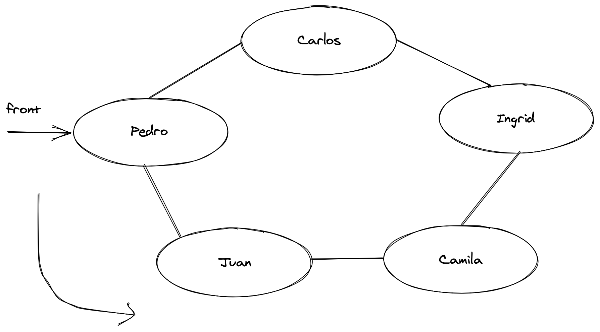
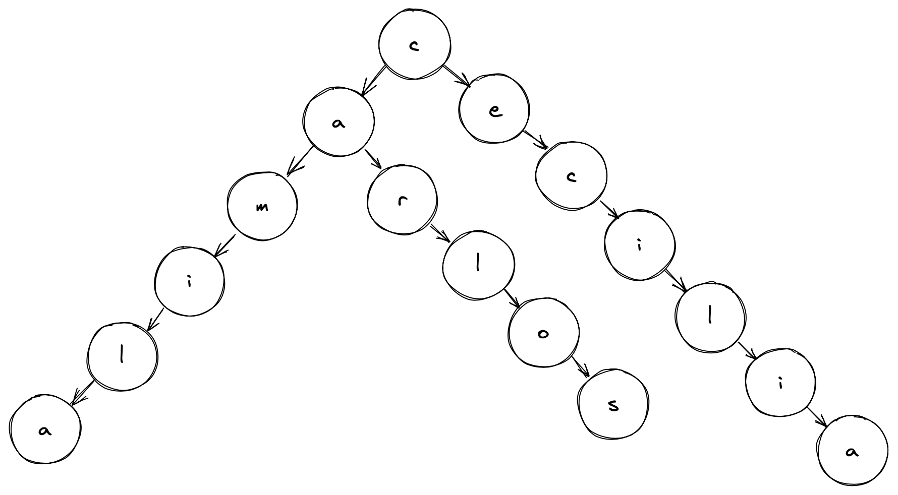

# workshop-dsa

## The circular queue – Hot Potato

An example of a circular queue is the Hot Potato game. In this game, children are organized in a circle, and they pass the hot potato to their neighbor as fast as they can. At a certain point of the game, the hot potato stops being passed around the circle of children, and the child that has the hot potato is removed from the circle. This action is repeated until there is only one child left (the winner).

## Trie (Prefix Tree)

A trie is special type of tree used commonly for searching strings and matching on stored strings. At each level, nodes can branch off to form complete words. For example, figure below shows a trie of the words: Camila, Carlos, Cecilia. Each ending node has a boolean flag: isCompleted. This indicates that the word ends in this path. For example, s in Carlos has endOfWord set to true.

